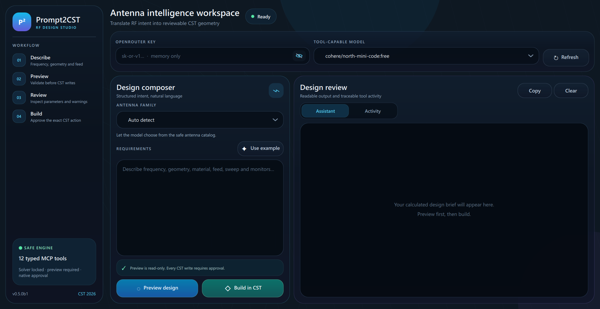
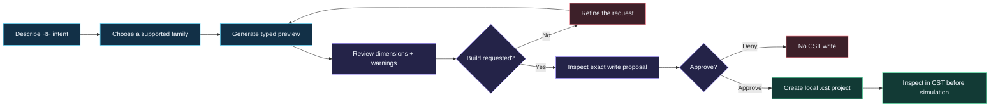
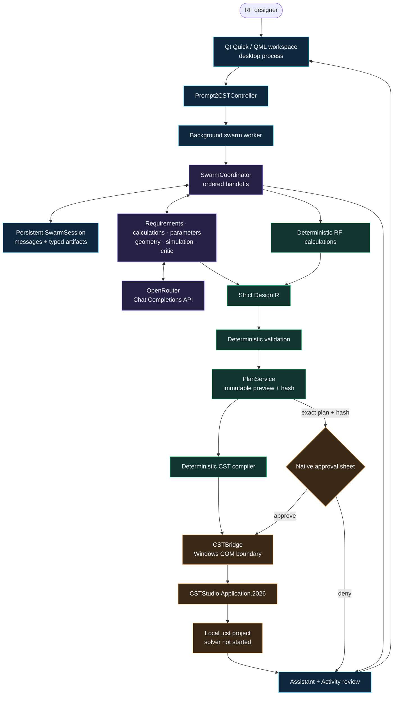
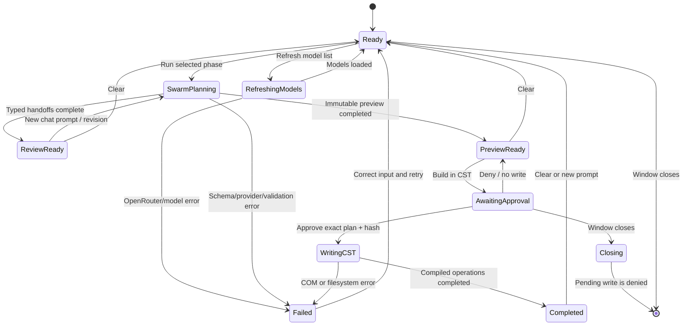
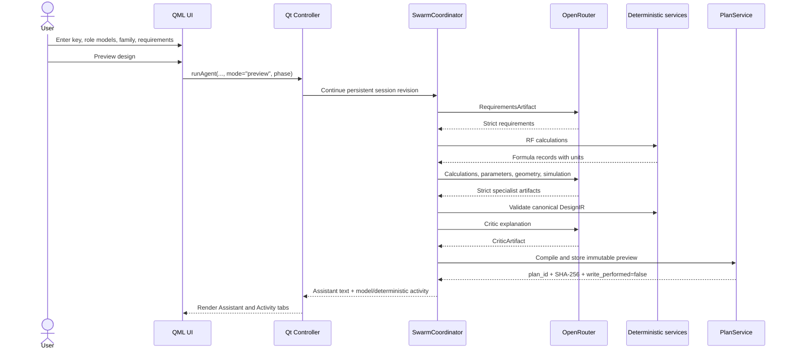
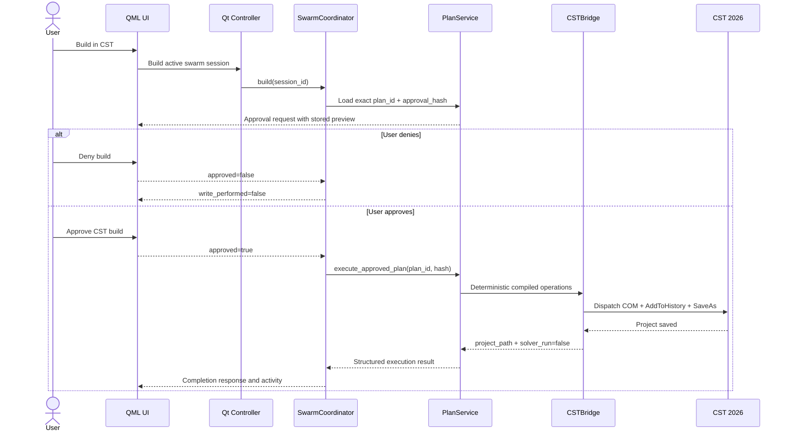

<p align="center">
  
</p>

<h1 align="center">Prompt2CST</h1>

<p align="center">
  <strong>Describe an antenna. Inspect the engineering. Approve the exact CST write.</strong>
</p>

<p align="center">
  A safety-first RF design workspace that turns natural-language intent into
  typed, reviewable CST Studio Suite 2026 geometry.
</p>

<p align="center">
  <a href="https://github.com/Mithunjagan/Prompt2CST/actions/workflows/tests.yml"></a>
  <a href="CHANGELOG.md"></a>
  <a href="pyproject.toml"></a>
  <a href="#platform-support"></a>
  <a href="#verification"></a>
  <a href="LICENSE"></a>
</p>

<p align="center">
  <a href="#quick-start"><strong>Quick start</strong></a>
  ·
  <a href="#the-20-mcp-tools"><strong>Explore the tools</strong></a>
  ·
  <a href="#architecture"><strong>See the architecture</strong></a>
  ·
  <a href="#runtime-flow-logs"><strong>Read the trace</strong></a>
</p>

<p align="center">
  
</p>

<p align="center">
  <sub>Qt Quick desktop workspace at 125% Windows scaling. API key intentionally hidden.</sub>
</p>

Prompt2CST is a Windows RF-design desktop application and local Model Context
Protocol (MCP) server. It connects configurable OpenAI-compatible model roles
to 20 typed tools that plan DesignIR, calculate, validate, compile, preview,
and—only after visible user approval with a matching immutable-plan
hash—write supported geometry into CST Studio Suite 2026.

| 🧠 Intent becomes engineering | 🛡️ Writes remain controlled | 🔎 Every step stays inspectable |
|---|---|---|
| Natural language is routed into dedicated calculations and strict geometry schemas. | Every write is paired with a preview, visible approval sheet, and server-side confirmation check. | Assistant output, MCP activity, proposed arguments, warnings, and saved project path remain reviewable. |

<p align="center">
  <strong>20 typed tools</strong> ·
  <strong>6 protected write tools</strong> ·
  <strong>4 antenna families</strong> ·
  <strong>63 tests</strong> ·
  <strong>0 solver calls</strong>
</p>

The application is built for traceable geometry generation, learning, and
prototyping. It does **not yet** run the CST solver or claim electromagnetic
performance. Result schemas and extraction boundaries exist, but missing CST
values are reported as unavailable rather than invented.

## DesignIR platform upgrade

The v0.6 development architecture removes antenna-family selection as a hard
limit. Existing families are compatibility templates that adapt into the same
strict `DesignIR 1.0` used for arbitrary supported structures.

- Seven configurable model roles support OpenRouter, generic
  OpenAI-compatible endpoints, fallbacks, retries, timeouts, health, accounting,
  cancellation, and a deterministic mock provider.
- A restricted expression parser accepts safe parameter arithmetic and rejects
  executable model output.
- The capability registry, rather than the antenna catalog, determines whether
  a requested primitive, Boolean, transform, port, boundary, solver, mesh,
  monitor, sweep, or optimization feature can compile.
- Batched MCP tools validate, compile, preview, hash, approve, execute, monitor,
  cancel, and extract one complete plan without one tool call per object.
- Immutable preview storage and SHA-256 content hashes invalidate approval when
  any design, validation, or compiled operation changes.
- The compiler emits deterministic, reviewable CST History List operations and
  never accepts model-generated macros.

See [the architecture](docs/architecture.md),
[DesignIR](docs/design-ir.md),
[model orchestration](docs/model-orchestration.md),
[the CST compiler](docs/cst-compiler.md), and
[the capability registry](docs/capability-registry.md).

> [!IMPORTANT]
> **Beta safety notice:** Always inspect geometry, units, materials, ports,
> boundaries, monitors, mesh settings, and project history inside CST before
> simulation. Prompt2CST generates first-pass models; it does not replace RF
> engineering review.

## The experience in one flow



## Contents

- [What the application can do](#what-the-application-can-do)
- [Why Prompt2CST feels different](#why-prompt2cst-feels-different)
- [What it cannot do](#what-it-cannot-do)
- [Platform support](#platform-support)
- [Prerequisites](#prerequisites)
- [Quick start](#quick-start)
- [What setup does](#what-setup-does)
- [How to run](#how-to-run)
- [Using the desktop application](#using-the-desktop-application)
- [Where outputs are stored](#where-outputs-are-stored)
- [Supported antenna families](#supported-antenna-families)
- [The 20 MCP tools](#the-20-mcp-tools)
- [Architecture](#architecture)
- [Application state machine](#application-state-machine)
- [Complete logic flow](#complete-logic-flow)
- [Runtime flow logs](#runtime-flow-logs)
- [Safety model](#safety-model)
- [Technology stack](#technology-stack)
- [Configuration](#configuration)
- [External MCP client setup](#external-mcp-client-setup)
- [Verification](#verification)
- [Fresh-clone completeness audit](#fresh-clone-completeness-audit)
- [Troubleshooting](#troubleshooting)
- [Repository file reference](#repository-file-reference)
- [Development](#development)
- [Security, limitations, and license](#security-limitations-and-license)

## What the application can do

- Accept a natural-language antenna request in a Qt Quick desktop interface.
- Filter OpenRouter’s current model list to models advertising tool-calling
  support.
- Ask a selected model to use a local, typed MCP tool catalog.
- Calculate and validate first-pass dimensions before any CST write.
- Preview readable design data and optional CST History List commands.
- Build supported CST geometry through the registered CST 2026 COM interface.
- Show the proposed build tool, complete arguments, and calculated preview in a
  modal approval sheet.
- Refuse the CST write when the user denies approval.
- Display the assistant response separately from the activity/tool trace.
- Sanitize project names, confine projects to one output directory, and reject
  accidental overwrite unless `overwrite=true` was explicitly proposed and
  approved.
- Provide a standalone stdio MCP server for compatible external clients.

## Why Prompt2CST feels different

| Generic LLM automation risk | Prompt2CST response |
|---|---|
| Model receives a general code or shell tool | Model receives a fixed catalog of typed RF/CST tools |
| Dimensions can be invented in prose | Dedicated calculations and strict schemas validate inputs |
| A write can happen inside an opaque agent step | Every write is mapped to a non-writing preview |
| Confirmation is only a prompt instruction | Desktop approval and server-side `confirm` checks are independent |
| Generated macros are difficult to trace | Arguments, preview, tool activity, History List blocks, and project path remain inspectable |
| Existing projects may be overwritten | Overwrite is false by default and must appear in the approved proposal |
| The assistant can imply simulation success | Solver execution is unavailable and results report `solver_run=false` |

## What it cannot do

The current beta intentionally does not provide:

- solver execution;
- S-parameter, VSWR, impedance, gain, efficiency, or radiation-pattern
  extraction;
- automatic electromagnetic validation;
- automatic launch of optimization or parameter sweeps;
- a verified live-CST local mesh-refinement compiler;
- a Learning Edition 100k-cell guarantee;
- waveguide ports;
- phased-array excitation;
- verified compilation for curves, helices, toroids, polygon extrusion,
  circular arrays, imported geometry, or general VBA/Python execution;
- cloud project storage.

Designs are not rejected merely because they lack a catalog family. If a
DesignIR requires an unavailable compiler capability, validation names that
exact capability, the closest supported alternative, and whether a compiler
extension can add it.

## Platform support

| Platform | Desktop UI | Preview/calculation | CST build | Support status |
|---|---:|---:|---:|---|
| Windows 11 x64 | Yes | Yes | Yes, with CST 2026 | Supported |
| Windows 10 x64 | Yes | Yes | Yes, with CST 2026 | Supported |
| Linux | Not supported by supplied setup | Python logic may be reusable manually | No COM automation | Unsupported |
| macOS | Not supported by supplied setup | Python logic may be reusable manually | No COM automation | Unsupported |

This repository does **not** run fully on every operating system. A complete
GUI-to-CST workflow requires Windows because CST automation uses
`CSTStudio.Application.2026` through Windows COM and `pywin32`.

The repository can be cloned to any directory and no longer assumes a `D:`
drive. In an editable checkout, generated CST projects default to the
repository’s local `outputs` directory.

## Prerequisites

### Required for setup and GUI preview

| Requirement | Details |
|---|---|
| Operating system | Windows 10 or Windows 11, 64-bit |
| Python | CPython 3.11 x64; Python 3.12+ is not accepted by this release |
| Internet | Required during dependency installation and for OpenRouter requests |
| OpenRouter account | Required for an API key and model access |
| Structured/tool model | Planning roles should support structured JSON output; legacy MCP use also needs tool/function calling |
| Disk space | Allow approximately 1 GB; the current development `.venv` is about 713 MB |
| PowerShell | Windows PowerShell 5.1 or PowerShell 7 |

### Additionally required for CST builds

| Requirement | Details |
|---|---|
| CST | CST Studio Suite 2026 installed locally |
| COM registration | `CSTStudio.Application.2026` must be registered |
| CST license | A valid license appropriate for the installed edition |
| Write access | Permission to create `.cst` files in the configured output directory |

You can launch the UI and run previews without CST. Build tools remain
unavailable until CST 2026 is installed and registered.

Useful official starting points:

- [Python downloads](https://www.python.org/downloads/)
- [OpenRouter](https://openrouter.ai/)
- [CST Studio Suite](https://www.3ds.com/products/simulia/cst-studio-suite)

## Quick start

### 1. Clone or download the repository

Using Git:

```powershell
git clone <your-repository-url>
cd Prompt2CST
```

Using GitHub’s ZIP download:

1. Download **Code → Download ZIP**.
2. Extract the entire archive; do not run it from inside the ZIP.
3. Open the extracted folder.

The folder may be located on `C:`, `D:`, another local drive, or a normal user
directory. Avoid read-only locations.

### 2. Run setup

Double-click:

```text
setup.bat
```

Or run it from PowerShell:

```powershell
powershell -NoProfile -ExecutionPolicy Bypass -File .\setup.ps1
```

Optional desktop shortcut:

```powershell
powershell -NoProfile -ExecutionPolicy Bypass -File .\setup.ps1 -CreateDesktopShortcut
```

### 3. Launch Prompt2CST

Double-click:

```text
Prompt2CST.bat
```

Or run:

```powershell
.\launch.ps1
```

### 4. Enter an OpenRouter key

Enter the key into the in-app **OpenRouter key** field. The desktop application
keeps it in process memory for the current session and does not save it to a
file.

### 5. Preview before building

Choose a family, enter the antenna requirements, and select **Preview design**.
Only select **Build in CST** after reviewing the calculated design and activity
trace.

## What setup does

`setup.bat` delegates to `setup.ps1`. The PowerShell setup performs these
steps:

1. Looks for Python 3.11 in this order:
   - Windows `py.exe -3.11`;
   - a Python 3.11 managed by `uv`;
   - the standard per-user Python 3.11 installation;
   - a compatible `uv` runtime under the user profile;
   - `python.exe` on `PATH`.
2. Creates a repository-local `.venv` when one does not exist.
3. Verifies that the `.venv` really uses Python 3.11.
4. Upgrades `pip`, `setuptools`, and `wheel`.
5. Installs Prompt2CST in editable mode with all declared dependencies.
6. Runs the complete offline unit-test suite.
7. Checks whether `CSTStudio.Application.2026` exists in the Windows registry.
8. Creates the repository-local `outputs` directory.
9. Optionally creates a desktop shortcut.

The setup now stops immediately if virtual-environment creation, package
installation, or tests fail. It does not print a false “Setup complete”
message after a failed native command.

Re-running setup is supported. If the existing `.venv` was created with the
wrong Python version, remove only `.venv` and run `setup.bat` again:

```powershell
Remove-Item -LiteralPath .\.venv -Recurse -Force
.\setup.bat
```

That command deletes only the generated virtual environment. It does not
delete source files or CST outputs.

## How to run

### Desktop application

Recommended:

```powershell
.\Prompt2CST.bat
```

Equivalent commands:

```powershell
.\launch.ps1
.\.venv\Scripts\python.exe -m prompt2cst.gui
.\.venv\Scripts\prompt2cst-gui.exe
```

### Standalone MCP server

For a compatible external stdio MCP client:

```powershell
.\.venv\Scripts\python.exe -m prompt2cst.server
```

or:

```powershell
.\.venv\Scripts\prompt2cst-mcp.exe
```

The stdio server is expected to remain running and communicate over standard
input/output; it is not a normal interactive command prompt.

### Offline test suite

```powershell
.\.venv\Scripts\python.exe -m unittest discover -s tests -v
```

### Dependency check

```powershell
.\.venv\Scripts\python.exe -m pip check
```

## Using the desktop application

### Interface areas

| Area | Purpose |
|---|---|
| OpenRouter key | Session-only credential entry with eye/eye-off visibility toggle |
| Structured/tool model | Editable model ID and refreshed OpenRouter list for structured-output or tool-capable models |
| Execution phase | Runs the specialist swarm through requirements, calculations, parameters, modeling, simulation, validation, or preview |
| Antenna family | Auto-detect or force one supported family |
| Requirements | Natural-language RF, geometry, material, feed, sweep, and monitor request |
| Prompt history | Saved conversation turns with session, phase, response, and activity until Clear is pressed |
| Preview design | Runs typed specialist handoffs and creates a non-writing immutable DesignIR preview |
| Build in CST | Executes only the active preview's exact plan ID and hash after approval; no planning model is called |
| Assistant tab | Markdown-formatted final model response |
| Activity tab | Model, role, phase, family, mode, MCP startup, tool calls, and errors |
| Copy / Clear | Copies the active review tab or clears current results and saved prompt history |

### Recommended design workflow

1. Enter the OpenRouter key.
2. Press **Refresh** or type a model ID that supports structured JSON output.
3. Assign the selected model to all roles, or use **Models** to assign separate
   requirements, calculations, parameters, geometry, simulation, and critic
   models.
4. Select the antenna family and execution phase.
5. Press **Use example** or enter a complete request.
6. Include:
   - target frequency;
   - required dimensions or design constraints;
   - conductor and substrate information;
   - feed and impedance;
   - frequency sweep;
   - boundary and monitor requirements.
7. Run early phases independently when you want requirements, calculations,
   parameters, modeling, simulation planning, or validation before preview.
   Keeping the prompt unchanged resumes from the last completed checkpoint;
   editing it starts a new revision and revokes the prior preview.
8. Press **Preview design**.
9. Read the **Assistant** response.
10. Inspect the **Activity** trace for every specialist handoff, actual model,
    fallback, deterministic calculation, validation event, and preview ID.
11. Correct the request if dimensions, assumptions, or warnings are unsuitable.
12. Press **Build in CST** only when the preview is acceptable.
13. Review the approval sheet:
    - `execute_approved_plan`;
    - exact immutable plan ID;
    - exact SHA-256 approval hash;
    - complete calculated and compiled non-writing preview.
14. Choose **Deny build** or **Approve CST build**.
15. Open the saved `.cst` project and inspect its History List and geometry.

Ready-to-use prompts are in [DEMO_PROMPTS.md](DEMO_PROMPTS.md).

## Where outputs are stored

### Default location

When installed through the supplied editable setup:

```text
<repository>\outputs\
```

Example:

```text
C:\Users\you\Projects\Prompt2CST\outputs\my_monopole.cst
```

When the package is installed outside an editable source checkout, the fallback
is:

```text
%USERPROFILE%\Documents\Prompt2CST\outputs\
```

Set `PROMPT2CST_OUTPUT_DIR` to override either default.

### What is persisted

| Item | Persisted? | Location |
|---|---:|---|
| Approved CST project | Yes | Configured output directory as `<sanitized-name>.cst` |
| Prompt history | Yes | `.prompt2cst-state\prompt_history.json` below the output directory |
| Swarm conversations and phase artifacts | Yes | `.prompt2cst-state\swarm_sessions\*.json` |
| Immutable plans and workflow state | Yes | `.prompt2cst-state\plans\` and `.prompt2cst-state\workflows\` |
| OpenRouter key | No | Process memory only |
| Assistant response | Yes, per prompt run | Saved in prompt history until Clear |
| Activity log | Yes, per prompt run | Saved in prompt history until Clear |
| Preview calculations | Yes | Saved in the active swarm session and immutable preview |
| Screenshots | Only if you take them | User-selected location |

Project names are reduced to letters, numbers, `_`, and `-`, then limited to 80
characters. Path traversal is rejected. Existing files are not overwritten
unless the proposed tool arguments contain `overwrite=true` and the user
approves that exact request.

The `outputs` directory is excluded by `.gitignore`; generated `.cst` projects,
logs, test wheels, and local screenshots should not be committed.

## Supported antenna families

| Family/tool | Preview | CST write | Current status | Important limitation |
|---|---:|---:|---|---|
| PEC probe brick | Yes | Yes | Diagnostic/known-good probe | Not an antenna substitute |
| Wire monopole | Yes | Yes | Verified family | Target installation and mesh still require inspection |
| Center-fed cylindrical dipole | Yes | Yes | Beta | Uses the validated parametric builder |
| Rectangular inset-fed patch | Yes | Yes | Geometry beta | No excitation port is created |
| Custom parametric antenna | Yes | Yes | Beta | Only validated bricks, axis-aligned cylinders, materials, and discrete ports |

### Wire monopole

Generates:

- PEC ground brick;
- cylindrical PEC radiator;
- discrete S-parameter port;
- frequency range;
- expanded-open boundaries;
- optional far-field monitor.

The default 2.45 GHz example uses a 30.6 mm wire length and corrected
0.612 mm wire radius.

### Center-fed dipole

Generates:

- two equal cylindrical PEC arms;
- a center feed gap;
- one discrete S-parameter port;
- expanded-open boundaries;
- far-field monitor.

### Rectangular patch

Calculates first-pass patch width and length using transmission-line equations,
effective permittivity, fringing extension, a Hammerstad-style microstrip-width
estimate, and an analytical inset depth.

The build creates FR-4, ground, patch sections, and feed-line geometry. It does
not create an excitation port, so it is not solver-ready.

### Custom parametric antenna

The validated Pydantic schema supports:

- up to 8 custom dielectric materials;
- 1 to 64 solids;
- bricks;
- cylinders aligned to x, y, or z;
- PEC and declared dielectric material references;
- up to 4 non-degenerate discrete ports;
- coordinates limited to ±5000 mm;
- optional expanded-open boundaries;
- optional far-field monitor.

Unknown fields, duplicate names/numbers, undefined materials, invalid ranges,
and degenerate ports are rejected.

## The 20 MCP tools

| Tool | Type | Purpose |
|---|---|---|
| `cst_status` | Read-only | Check Windows/CST registration and optionally test a live COM connection |
| `antenna_catalog` | Read-only | Return supported families, primitives, and unsupported capabilities |
| `preview_test_brick` | Preview | Return a harmless PEC probe-brick history command |
| `build_test_brick` | Compatibility preview | Adapt the probe brick to DesignIR and store an immutable plan; never writes directly |
| `preview_rectangular_patch` | Preview | Calculate first-pass rectangular patch dimensions |
| `build_rectangular_patch` | Compatibility preview | Adapt patch inputs to an immutable DesignIR plan |
| `preview_wire_monopole` | Preview | Validate and preview monopole, ground, port, boundaries, and monitor |
| `build_wire_monopole` | Compatibility preview | Adapt monopole inputs to an immutable DesignIR plan |
| `preview_center_fed_dipole` | Preview | Validate and preview the two-arm dipole |
| `build_center_fed_dipole` | Compatibility preview | Adapt dipole inputs to an immutable DesignIR plan |
| `preview_parametric_antenna` | Preview | Validate and preview a custom primitive specification |
| `build_parametric_antenna` | Compatibility preview | Adapt the validated custom specification to an immutable DesignIR plan |
| `validate_design_plan` | Read-only | Run deterministic validation for one complete DesignIR |
| `compile_design_plan` | Read-only | Compile a valid DesignIR into deterministic CST operations |
| `preview_design_plan` | Preview | Validate, compile, hash, and immutably store one batched plan |
| `get_design_plan` | Read-only | Retrieve the exact immutable approval preview |
| `execute_approved_plan` | Write | Execute an unchanged plan only when a persisted desktop approval record and exact hash both exist |
| `get_execution_status` | Read-only | Read persisted execution state and completed operations |
| `cancel_execution` | Control | Request cancellation between deterministic CST operations |
| `extract_simulation_results` | Read-only | Return normalized values or honest unavailable-output records |

Only `execute_approved_plan` can reach `CSTBridge`. The five legacy `build_*`
names remain as compatibility wrappers, but they now adapt inputs through
DesignIR and return immutable previews regardless of `confirm`. After the
native approval callback, the desktop writes a persisted approval record;
`approved=true` alone cannot authorize execution.

## Architecture

### Component architecture



### Layer responsibilities

| Layer | Main files | Responsibility |
|---|---|---|
| Presentation | `qml/Main.qml`, `GlassPanel.qml`, `LiquidButton.qml`, `ChevronIndicator.qml` | Responsive desktop layout, inputs, review tabs, approval dialog, visual feedback |
| Desktop controller | `gui.py`, `ui_logic.py` | Qt properties/signals, worker lifetime, request composition, error display, approval synchronization |
| Swarm orchestration | `swarm.py`, `orchestration.py` | Typed specialist artifacts, ordered handoffs, role routing, fallbacks, accounting, revision invalidation |
| Compatibility agent | `agent.py` | Legacy OpenRouter/MCP tool loop retained for non-desktop compatibility |
| MCP interface | `server.py` | 20 typed tools, batched plans, confirmation checks, preview/build separation |
| Universal design model | `design_ir.py`, `adapters.py` | Strict DesignIR 1.0, safe expressions, legacy-family conversion |
| Deterministic validation | `validation.py`, `capabilities.py` | Schema, dependency, geometry, material, port, simulation, mesh and sweep gates |
| CST compiler | `cst_compiler/` | Stable History List operation generation organized by responsibility |
| Plan lifecycle | `plan_service.py`, `workflow.py` | Persistent state machine, immutable previews, approval hashes and progress |
| Conversation history | `session_history.py`, `swarm.py` | Prompt summaries plus persistent messages, artifacts, DesignIR, plan references, and execution state |
| Results | `results.py` | Typed SimulationResult values with explicit provenance |
| Capability truth | `catalog.py` | Supported families, primitives, and explicit unsupported features |
| RF calculations | `design.py` | Patch, monopole, and dipole inputs, validation, and calculated dimensions |
| Custom schema | `parametric.py` | Strict materials, solids, ports, coordinate limits, and cross-field validation |
| CST command generation | `cst_macros.py` | Deterministic CST History List blocks; no solver start |
| CST integration | `cst_bridge.py` | COM registration/connection, project creation, output confinement, `SaveAs` |
| Packaging/setup | `pyproject.toml`, setup/launch scripts | Dependencies, entry points, QML/SVG packaging, reproducible local environment |

The desktop application launches the MCP server as a local child process using
the same Python interpreter. It does not expose an HTTP server or listen on a
network port. Prompt runs are persisted as local state records so the desktop
can behave like a phase-by-phase chat until the user presses **Clear**.

## Application state machine

The UI uses a small set of observable states driven by `busy`, status text,
worker lifetime, and the optional pending approval request.



### Status-to-state map

| Visible status | Internal meaning | Permitted next action |
|---|---|---|
| `Ready` | No worker is active | Refresh, preview, or build |
| `Refreshing structured/tool models…` | OpenRouter model metadata is loading | Wait or inspect an error |
| `Generating safe preview…` | Preview-mode agent loop is active | Wait for Assistant/Activity |
| `Preparing CST build…` | Build-mode agent loop is active | Wait for preview/tool proposal |
| `Review required before CST write` | Worker is blocked on the approval sheet | Approve or deny |
| `CST build approved…` | Approval returned true; write may proceed | Wait for CST/tool result |
| `CST build denied · finalizing response…` | Write was rejected | Wait for the model’s final response |
| `Completed` | Agent loop returned a readable response | Inspect, copy, clear, or start again |
| `Failed` | Error details were placed in Activity | Correct the cause and retry |

## Complete logic flow

### Preview flow



### Build and approval flow



### Failure flow

1. Invalid GUI input is rejected before a worker starts.
2. OpenRouter HTTP failures are shown with status and response details.
3. Each specialist response must validate against its strict Pydantic artifact.
4. Typed calculations reject invalid ranges and remain authoritative for arithmetic.
5. Deterministic validation blocks unsafe or unsupported DesignIR.
6. Build is disabled until the active session owns a non-blocking immutable preview.
7. Every new chat revision revokes the prior awaiting-approval plan.
8. Denial returns `write_performed=false`; the CST bridge is never called.
9. COM and filesystem exceptions appear in the Activity tab and error toast.

## Runtime flow logs

The **Activity** tab is a compact execution trace, not a hidden debug console.
Every request records the swarm session/revision, specialist role, actual
provider/model, fallbacks, deterministic calculations, validation, immutable
preview, approval, and CST execution events.

### Log pipeline

```mermaid
flowchart LR
    Header["Session header<br/>session · revision · target phase"]
    Worker["Swarm worker started"]
    Roles["Typed specialist handoffs"]
    Calc["Deterministic calculations"]
    Validation["Deterministic validation"]
    Preview["Immutable plan + hash"]
    Approval["Approval sheet"]
    Denied["denied<br/>write_performed=false"]
    Write["Exact compiled operation sequence"]
    Result["Assistant response<br/>or exact error"]

    Header --> Worker --> Roles --> Calc --> Validation --> Preview --> Result
    Preview -->|"Build"| Approval
    Approval -->|"deny"| Denied --> Result
    Approval -->|"approve"| Write --> Result

    classDef trace fill:#10283d,stroke:#55d7ff,color:#f4f9ff;
    classDef gate fill:#252044,stroke:#9e8cff,color:#f4f9ff;
    classDef denied fill:#3d2029,stroke:#ff7b8a,color:#f4f9ff;
    classDef write fill:#12352f,stroke:#55e6a5,color:#f4f9ff;
    class Header,Worker,Roles,Calc,Validation,Preview,Result trace;
    class Gate,Approval gate;
    class Denied denied;
    class Write write;
```



### Example: preview trace

```text
[swarm] session=<id> revision=1
[model] phase=requirements role=requirements_model provider=openrouter model=<model>
[model] phase=calculations role=calculations_model provider=openrouter model=<model>
[deterministic] completed 4 RF formulas
[model] phase=parameters role=parameters_model provider=openrouter model=<model>
[model] phase=modeling role=geometry_model provider=openrouter model=<model>
[model] phase=simulation role=simulation_model provider=openrouter model=<model>
[deterministic] validation passed
[model] phase=validation role=critic_model provider=openrouter model=<model>
[preview] plan=<id> approval_allowed=true write_performed=false
```

### Example: approved build trace

```text
UI status: Review required before CST write
Tool: execute_approved_plan
Arguments: plan_id=<id>, approval_hash=<sha256>
User action: Approve CST build
UI status: CST build approved…
[cst] execution <id>: COMPLETED
```

### Example: denied write

```text
UI status: Review required before CST write
User action: Deny build
[approval] user denied CST execution
Result: APPROVAL_DENIED, write_performed=false
```

### Reading a failure

When a request fails, the Assistant tab shows a short failure message and the
Activity tab adds an `ERROR` block with the flattened underlying exception.
Typical causes include:

- OpenRouter authentication or rate-limit errors;
- model responses with invalid tool arguments;
- MCP startup or call timeouts;
- typed validation errors;
- CST COM registration/license failures;
- output-path or overwrite errors.

No API key is written into the Activity log by Prompt2CST.

## Safety model

### Controls implemented in code

- Desktop planning models receive strict response schemas and no CST-writing
  tools.
- Requirements, calculations, parameters, modeling, simulation, and critique
  are separate role-routed handoffs with persisted provenance.
- RF arithmetic, validation, compilation, preview hashing, and execution are
  deterministic services.
- Build makes zero model calls and executes only the current session's exact
  immutable plan ID and SHA-256 hash.
- A new conversation revision revokes the prior plan's awaiting-approval state.
- No general shell, Python, VBA, or arbitrary-code MCP tool.
- The legacy MCP compatibility agent retains an explicit set of known write
  tools and preview mappings; the desktop swarm does not use that write path.
- One-to-one mapping from each write tool to its preview tool.
- Preview arguments remove project name, overwrite, confirmation, and
  build-only switches.
- Approval displays the exact proposed build arguments and calculated preview.
- `confirm=true` is added only after approval.
- Server-side build functions independently refuse calls without
  `confirm=true`.
- Strict Pydantic models use `extra="forbid"`.
- Project names are sanitized and resolved paths must remain below the output
  root.
- Existing projects are protected by default.
- Generated history contains no `Solver.Start`.
- Results always report `solver_run=false`.

### Trust boundaries

| Data/action | Boundary |
|---|---|
| OpenRouter key | Sent only to OpenRouter API calls; kept in desktop process memory |
| User prompt | Sent to the selected OpenRouter model |
| Tool schemas/results | Exchanged with OpenRouter to support the agent loop |
| MCP transport | Local stdio child process |
| CST write | Local COM call after desktop approval |
| CST project | Local configured output directory |

Read [SECURITY.md](SECURITY.md) before publishing or extending the project.

## Technology stack

| Technology | Use |
|---|---|
| Python 3.11 | Application, agent, MCP server, calculations, automation |
| PySide6 / Qt 6 | Desktop runtime |
| Qt Quick / QML | Responsive liquid-glass user interface |
| Model Context Protocol (`mcp`) | Local typed tool discovery and calls |
| FastMCP | stdio MCP server implementation |
| HTTPX | Async OpenRouter API requests |
| Pydantic v2 | Strict custom-geometry schemas and validation |
| OpenRouter Chat Completions API | Tool-capable LLM orchestration |
| `pywin32` | CST Windows COM dispatch |
| CST History List commands | Deterministic geometry/material/port setup |
| `unittest` | Offline safety, calculation, macro, and repository tests |
| GitHub Actions | Windows/Python 3.11 continuous integration |
| Setuptools / `pyproject.toml` | Packaging and console entry points |
| PowerShell and batch files | Double-click setup and launch |

## Configuration

### Environment variables

| Variable | Default | Purpose |
|---|---|---|
| `PROMPT2CST_OUTPUT_DIR` | Checkout `outputs`; installed fallback under Documents | Overrides the CST project directory |
| `PROMPT2CST_CST_PROGID` | `CSTStudio.Application.2026` | Overrides the CST COM ProgID |
| `PROMPT2CST_STATE_DIR` | Output directory `/.prompt2cst-state` | Persistent workflows, immutable plans and execution records |
| `PROMPT2CST_MAX_SWEEP_CASES` | `200` | Blocks excessive Cartesian sweep expansion |
| `PROMPT2CST_MAX_ESTIMATED_MESH_CELLS` | `100000` | Configurable licence/mesh guard |
| `MODEL_PROVIDER` | `openrouter` | Provider ID for model roles |
| `MODEL_BASE_URL` | OpenRouter API | Generic OpenAI-compatible endpoint |
| `MODEL_<ROLE>` | Empty / selected desktop model | Per-role model assignment |
| `MODEL_<ROLE>_FALLBACKS` | Empty | Comma-separated fallback IDs |
| `MODEL_TIMEOUT_SECONDS` | `60` | Per-call timeout |
| `MODEL_MAX_RETRIES` | `2` | Bounded structured-output retry count |
| `MODEL_MAX_TOOL_CALLS` | `8` | Bounded compatibility-agent step count |

Example for one PowerShell session:

```powershell
$env:PROMPT2CST_OUTPUT_DIR = "C:\RFProjects\Prompt2CST"
$env:PROMPT2CST_CST_PROGID = "CSTStudio.Application.2026"
.\Prompt2CST.bat
```

The GUI does not currently read `OPENROUTER_API_KEY` from the environment. Enter
the key in the application.

### Model selection

The initial model field contains:

```text
cohere/north-mini-code:free
```

Model availability and tool behavior can change. **Refresh** queries OpenRouter
and retains only models whose metadata advertises `tools`. Metadata support
does not guarantee that a model will call tools reliably. Free models may be
rate-limited or removed.

## External MCP client setup

Copy [codex-config.toml.example](codex-config.toml.example) and replace its
placeholder paths with the absolute checkout path.

Example:

```toml
[mcp_servers.prompt2cst]
command = "C:/absolute/path/to/Prompt2CST/.venv/Scripts/python.exe"
args = ["-m", "prompt2cst.server"]
cwd = "C:/absolute/path/to/Prompt2CST"
startup_timeout_sec = 20
tool_timeout_sec = 120
required = true
```

External clients do not automatically reproduce the desktop approval sheet.
They must honor the server instructions: preview first, obtain explicit user
approval, then pass `confirm=true`. The desktop application provides the
strongest built-in approval flow.

## Verification

### Commands

```powershell
# Full offline suite
.\.venv\Scripts\python.exe -m unittest discover -s tests -v

# Installed dependency consistency
.\.venv\Scripts\python.exe -m pip check

# Python syntax/bytecode compilation
.\.venv\Scripts\python.exe -m compileall -q src tests

# QML static validation
.\.venv\Scripts\pyside6-qmllint.exe `
  -I src\prompt2cst\qml `
  src\prompt2cst\qml\Main.qml `
  src\prompt2cst\qml\GlassPanel.qml `
  src\prompt2cst\qml\LiquidButton.qml `
  src\prompt2cst\qml\ChevronIndicator.qml

# Build a wheel without reinstalling dependencies
.\.venv\Scripts\python.exe -m pip wheel . --no-deps --wheel-dir outputs\package-audit
```

### Current repository audit

Validated for v0.5.0b1 on Windows with Python 3.11:

- 63 unit tests pass;
- `pip check` reports no broken requirements;
- Python source and tests compile;
- all QML files pass `qmllint`;
- PowerShell setup and launch scripts parse successfully;
- the wheel builds successfully;
- the wheel contains `Main.qml`, every QML component, and the SVG icon;
- all required setup, launch, package, source, test, and CI files exist;
- `CSTStudio.Application.2026` is registered on the audited machine;
- a live, non-writing CST COM handshake succeeds;
- the output directory resolves to this checkout’s `outputs` folder.

The audit did **not** create or overwrite a CST project and did not run a
solver. A real approved build remains the final machine-specific integration
test.

### What can be tested without external services

- RF calculation validation;
- strict parameter schemas;
- CST History List string generation;
- solver-start absence;
- project-name sanitization;
- preview-before-write behavior;
- approval denial and confirmation injection;
- package resources and launcher presence;
- QML static validity.

### What requires external software or credentials

- OpenRouter model listing and model responses require a valid API key and
  network connection.
- CST project creation requires Windows, CST 2026, COM registration, and a
  valid CST license.
- Electromagnetic correctness requires manual CST inspection and simulation
  outside Prompt2CST.

## Fresh-clone completeness audit

| Item | In GitHub repository? | Generated/external? | Required action on a new machine |
|---|---:|---|---|
| Python source | Yes | — | Clone/download |
| QML interface and components | Yes | — | Clone/download |
| Application SVG icon | Yes | — | Clone/download |
| `pyproject.toml` dependencies and entry points | Yes | — | Clone/download |
| Setup and launch scripts | Yes | — | Clone/download |
| Unit tests | Yes | — | Run by setup |
| Windows CI workflow | Yes | — | Runs on push/PR |
| `.venv` | No | Generated | Created by setup |
| `prompt2cst_mcp.egg-info` | No | Generated by editable install | Created by `pip install -e` |
| `__pycache__` / `.pyc` | No | Generated | Created by Python |
| `outputs` | No | Generated/local | Created by setup and builds |
| OpenRouter key | No | Private external secret | User enters in GUI |
| Python 3.11 | No | External prerequisite | User installs |
| CST Studio Suite 2026 | No | Licensed external prerequisite | User installs/registers |
| CST license | No | External prerequisite | User provides |

The source repository is complete for setup on a compatible Windows system.
Generated environments, proprietary CST software, licenses, and private API
keys must not be committed.

## Troubleshooting

### `Python 3.11 was not found`

Install Python 3.11 x64, ensure the Python launcher is enabled, or run:

```powershell
uv python install 3.11
```

Then rerun `setup.bat`.

### `The existing .venv is not Python 3.11`

Remove only the generated environment and rebuild it:

```powershell
Remove-Item -LiteralPath .\.venv -Recurse -Force
.\setup.bat
```

### Setup fails during dependency installation

Check:

- internet access;
- proxy/firewall rules for Python package downloads;
- available disk space;
- write access to the repository directory;
- the complete error shown above `Setup failed`.

The setup script now exits at the failing step.

### The GUI launches but CST builds fail

Run:

```powershell
.\.venv\Scripts\python.exe -c "from prompt2cst.cst_bridge import CSTBridge; print(CSTBridge().status(True))"
```

Confirm:

- `registered` is `True`;
- `connected` is `True`;
- the ProgID matches the installed CST version;
- a valid CST license is available.

If a different ProgID is required:

```powershell
$env:PROMPT2CST_CST_PROGID = "Your.Registered.CST.ProgID"
.\Prompt2CST.bat
```

### `already exists; set overwrite=true`

Prompt2CST protects existing `.cst` files. Use a different project name, move
the old project, or approve a build whose visible arguments explicitly contain
`overwrite=true`.

### OpenRouter HTTP 401 or 403

- verify the key;
- revoke and replace an exposed key;
- check account/model access;
- do not paste the key into prompts, issues, or screenshots.

### OpenRouter HTTP 429

The selected model or account is rate-limited. Wait, refresh the model list, or
assign another structured-output model to the affected specialist role.

### A model rejects strict JSON schema output

The provider first requests strict JSON Schema, then retries a rejected format
with JSON Object mode while retaining strict local Pydantic validation. If both
fail, assign a stronger structured-output model or configure a role fallback
and inspect the exact role/model error in Activity.

### The model ID is no longer available

Press **Refresh** and choose a current structured-output or tool model. The default free
model is only an initial value, not a guaranteed permanent service.

### The preview works but no `.cst` file appears

A preview never writes a project. For a build:

1. press **Build in CST**;
2. approve the exact request;
3. read the Activity tab;
4. check the configured output directory;
5. verify CST COM connectivity.

### UI scaling or clipped controls

The QML layout includes a compact mode for shorter logical viewports and has
been checked at 100% and 125% Windows scaling. If Windows cached an older
process, close and relaunch Prompt2CST after updating the repository.

### PowerShell execution policy blocks direct `.ps1` execution

Use the supplied `.bat` files or:

```powershell
powershell -NoProfile -ExecutionPolicy Bypass -File .\setup.ps1
```

### Clean uninstall

Prompt2CST does not install a system service. To remove the local Python
environment, delete `.venv`. Remove any desktop shortcut separately. Preserve
or back up `outputs` before deleting the repository if it contains CST
projects.

## Repository file reference

### Root files

| Path | Purpose |
|---|---|
| `README.md` | Complete project overview, architecture, setup, operation, outputs, troubleshooting, and inventory |
| `pyproject.toml` | Package metadata, Python/dependency constraints, console scripts, QML/SVG package data |
| `setup.bat` | Double-click setup wrapper with visible failure output |
| `setup.ps1` | Python discovery, `.venv` creation, installation, tests, CST registry check, outputs, shortcut |
| `install.ps1` | Backward-compatible alias that forwards to `setup.ps1` |
| `Prompt2CST.bat` | Double-click GUI launcher |
| `launch.ps1` | Validates `.venv`, sets the checkout working directory, and launches the GUI |
| `codex-config.toml.example` | Example external stdio MCP client configuration |
| `DEMO_PROMPTS.md` | Safe preview-first requests for supported families |
| `SECURITY.md` | API-key handling, CST write boundary, and vulnerability reporting |
| `CONTRIBUTING.md` | Development workflow and rules for new antenna families |
| `CHANGELOG.md` | Version history |
| `LICENSE` | MIT license |
| `.gitignore` | Excludes environments, build artifacts, secrets, outputs, CST projects, and editor state |
| `.env.example` | Secret-safe provider, role, timeout, sweep, mesh, state and CST environment template |
| `AGENTS.md` | Architecture, conventions, commands, security/CST rules and definition of done |

### GitHub automation

| Path | Purpose |
|---|---|
| `.github/workflows/tests.yml` | Installs on Windows/Python 3.11 and runs the unit tests on pushes and pull requests |

### Documentation

| Path | Purpose |
|---|---|
| `docs/architecture.md` | Short architecture and safety-boundary companion |
| `docs/design-ir.md` | DesignIR schema, safe expressions and extension process |
| `docs/model-orchestration.md` | Roles, providers, fallbacks, health and configuration |
| `docs/cst-compiler.md` | Deterministic compiler modules and extension rules |
| `docs/capability-registry.md` | Compiler capability source of truth |
| `docs/security.md` | Threat boundaries, hashing, state and injection controls |
| `docs/testing.md` | Offline and live-CST verification |
| `docs/screenshots/README.md` | Safe instructions for maintaining public screenshots without credentials |
| `docs/screenshots/prompt2cst-workspace.png` | Sanitized GitHub hero screenshot of the complete desktop workspace |

### Python package

| Path | Purpose |
|---|---|
| `src/prompt2cst/__init__.py` | Package description and version |
| `src/prompt2cst/__main__.py` | Enables `python -m prompt2cst` to launch the GUI |
| `src/prompt2cst/gui.py` | Qt application, controller properties/signals, workers, approval synchronization, errors, Windows backdrop |
| `src/prompt2cst/ui_logic.py` | Family selector data, examples, and preview/build prompt composition |
| `src/prompt2cst/agent.py` | OpenRouter client, MCP child session, tool loop, error formatting, timeouts, preview/approval enforcement |
| `src/prompt2cst/server.py` | FastMCP server and all 20 typed tools |
| `src/prompt2cst/catalog.py` | Honest capability and limitation catalog exposed to the model |
| `src/prompt2cst/design.py` | Patch, monopole, and dipole calculations and input validation |
| `src/prompt2cst/parametric.py` | Strict custom materials, solids, ports, limits, and summary models |
| `src/prompt2cst/cst_macros.py` | CST History List generation for units, materials, geometry, ports, boundaries, and monitors |
| `src/prompt2cst/cst_bridge.py` | CST COM status/build methods, portable output defaults, path confinement, overwrite protection |
| `src/prompt2cst/design_ir.py` | Strict versioned DesignIR and restricted expression evaluator |
| `src/prompt2cst/calculations.py` | Deterministic RF formulas with provenance records |
| `src/prompt2cst/capabilities.py` | Capability registry and requested-capability resolution |
| `src/prompt2cst/validation.py` | Deterministic validation findings and severity policy |
| `src/prompt2cst/adapters.py` | Existing-family and custom-parametric DesignIR adapters |
| `src/prompt2cst/orchestration.py` | Model provider interface, role router, retries, fallbacks and health |
| `src/prompt2cst/session_history.py` | Local prompt-run history persisted until the desktop Clear action |
| `src/prompt2cst/swarm.py` | Specialist artifacts, conversation sessions, ordered handoffs, deterministic phase gates, immutable preview binding and build execution |
| `src/prompt2cst/workflow.py` | Persistent explicit workflow state machine |
| `src/prompt2cst/plan_service.py` | Batched preview, immutable storage, hashing, execution and cancellation |
| `src/prompt2cst/results.py` | SimulationResult schema and provenance-safe normalization |
| `src/prompt2cst/cst_compiler/` | Parameters, materials, primitives, booleans, transforms, ports, simulation, sweeps and outputs |
| `src/prompt2cst/assets/prompt2cst.svg` | Packaged application icon |

### QML interface

| Path | Purpose |
|---|---|
| `src/prompt2cst/qml/Main.qml` | Main responsive workspace, key/model inputs, phase selector, prompt history, composer, review tabs, approval dialog, errors |
| `src/prompt2cst/qml/GlassPanel.qml` | Reusable translucent panel surface |
| `src/prompt2cst/qml/LiquidButton.qml` | Reusable centered, animated button |
| `src/prompt2cst/qml/ChevronIndicator.qml` | DPI-independent drawn dropdown chevron |

### Tests

| Path | Purpose |
|---|---|
| `tests/test_agent.py` | Tool-schema conversion, model filtering, argument parsing, write classification, denial, confirmation injection |
| `tests/test_catalog.py` | Capability truth and solver-disabled assertions |
| `tests/test_design.py` | Patch dimensions, frequency behavior, monopole placement, dipole placement, invalid inputs |
| `tests/test_macros.py` | Generated CST objects, ports, path sanitization, and solver-start absence |
| `tests/test_parametric.py` | Strict schema, material references, extra-field rejection, port validation |
| `tests/test_repository.py` | Version consistency, packaged resources, launchers, output portability, secret scanning |
| `tests/test_ui_logic.py` | Preview/build prompt boundaries and empty-request rejection |
| `tests/test_calculations.py` | RF formulas, unit conversion and engineering recommendations |
| `tests/test_design_ir.py` | Safe expressions, adapters, validation, booleans, transforms and determinism |
| `tests/test_gui_controller.py` | History prompt restoration, Clear behavior and pending-plan invalidation |
| `tests/test_orchestration.py` | Model fallback, structured-output rejection and secret redaction |
| `tests/test_plan_service.py` | Batched preview, immutable hashes, execution progress and honest results |
| `tests/test_session_history.py` | Prompt-run persistence, ordering, cap and Clear behavior |
| `tests/test_swarm.py` | Specialist order, deterministic calculations, revision invalidation, exact-plan build, denial and session persistence |

### Generated, private, and local-only paths

These may exist after setup or development but should not be uploaded:

| Path/pattern | Created by | Meaning |
|---|---|---|
| `.venv/` | `setup.ps1` | Local Python environment and dependencies |
| `src/prompt2cst_mcp.egg-info/` | Editable install | Generated package metadata |
| `**/__pycache__/`, `*.pyc` | Python | Bytecode cache |
| `outputs/` | Setup, package audit, screenshots, CST builds | Local generated artifacts |
| `outputs/*.cst` | Approved build | CST projects |
| `build/`, `dist/`, `*.whl` | Packaging tools | Distribution artifacts |
| `.env`, `.env.*`, `*.key` | User, if created | Private secrets; Prompt2CST does not require them |
| `.idea/`, `.vscode/` | Editors | Local workspace settings |
| `.pytest_cache/`, `.coverage`, `htmlcov/` | Optional test tools | Local test/coverage output |

## Development

### Local workflow

```powershell
.\setup.bat
.\.venv\Scripts\python.exe -m unittest discover -s tests -v
.\Prompt2CST.bat
```

Most tests do not require CST. Do not declare a new builder verified until its
generated History List and project have been inspected on CST 2026.

### Adding an antenna family

1. Add validated typed inputs/calculations.
2. Add deterministic History List generation.
3. Add a preview tool.
4. Add a separate build tool.
5. Add the build tool to `WRITE_TOOLS`.
6. Map it to the preview in `PREVIEW_FOR_WRITE`.
7. Keep the build server-side `confirm` check.
8. Update the capability catalog and GUI family options.
9. Add valid, invalid, boundary, denial, and solver-absence tests.
10. Inspect a real generated CST project.
11. Update this README, `CHANGELOG.md`, and supporting documentation.

Never add an unrestricted model-generated Python, shell, or VBA execution tool.
Solver execution requires a separate safety design and explicit user gate.

See [CONTRIBUTING.md](CONTRIBUTING.md).

## Security, limitations, and license

- Security guidance: [SECURITY.md](SECURITY.md)
- Detailed demo prompts: [DEMO_PROMPTS.md](DEMO_PROMPTS.md)
- Architecture companion: [docs/architecture.md](docs/architecture.md)
- Changelog: [CHANGELOG.md](CHANGELOG.md)
- License: [MIT](LICENSE)

Prompt2CST v0.5.0b1 is beta software for education and prototyping.

MIT © 2026 Mithun Kumar J.
