# Architecture

Prompt2CST is a Python 3.11/PySide6 desktop application with a local FastMCP
compatibility server. There is no browser frontend or public HTTP backend.
CST 2026 COM automation is the final local write boundary.

```mermaid
flowchart LR
    UI["Qt Quick desktop"] --> Controller["Qt controller"]
    Controller --> Session["Persistent swarm session"]
    Session --> Coordinator["Swarm coordinator"]
    Coordinator --> Req["Requirements model"]
    Req --> Calc["Deterministic RF calculations"]
    Calc --> RF["Calculation reasoning model"]
    RF --> Params["Parameter model"]
    Params --> Geometry["Geometry model"]
    Geometry --> Simulation["Simulation model"]
    Simulation --> Validate["Deterministic validator"]
    Validate --> Critic["Critic model"]
    Critic --> Compiler["Deterministic CST compiler"]
    Compiler --> Preview["Immutable preview + SHA-256"]
    Preview --> Approval{"Human approval"}
    Approval -->|"exact plan + matching hash"| Bridge["CST COM bridge"]
    Bridge --> CST["New CST 2026 project"]
```

## Swarm runtime

Each changed non-build prompt is a new revision in one persisted design
conversation. Reusing the same prompt for a later phase resumes from the last
typed checkpoint without repeating completed specialist calls. The coordinator
runs through the selected target phase:

`requirements -> calculations -> parameters -> modeling -> simulation ->
validation -> preview`.

Every model handoff uses a strict Pydantic artifact. Models never receive a
CST-writing tool. The calculation service owns arithmetic, the validator owns
blocking decisions, and the compiler owns executable CST History List text.
The critic may explain findings but cannot override deterministic errors.

Selecting an early phase stops the chain at that checkpoint. Selecting Preview
runs all missing work, stores the canonical DesignIR and model provenance, then
creates an immutable plan. A later chat message begins a new revision, clears
downstream artifacts, and moves the prior plan out of `AWAITING_APPROVAL`.

Build is not a model phase. It is enabled only when the active session has a
non-blocking immutable preview. The controller displays that exact plan ID,
content hash, and preview for approval; the deterministic executor then calls
`PlanService.execute_approved_plan()`. No model regenerates the design during
Build.

## Persistence

Prompt-run summaries live in `prompt_history.json`. Typed conversation state,
messages, phase artifacts, DesignIR, validation, model accounting, plan
references, and execution results live in `swarm_sessions/*.json`. Immutable
plans, workflow records, and execution progress use their existing state
folders. All are below the configured state directory. The desktop **Clear**
action invalidates every pending plan before removing prompt and swarm-session
history; generated plan and execution records remain auditable state.

## Trust boundaries

Model output is schema input, never executable code. Only the compiler creates
CST History List commands. Preview performs no COM writes. Execution needs the
stored plan ID, exact SHA-256 content hash, and explicit approval. The bridge
creates a new project, records each completed operation, stops at the exact
failed operation, and saves only after the compiled sequence completes.

## Compatibility

Wire monopole, center-fed dipole, rectangular patch, and custom parametric
inputs have DesignIR adapters. Legacy MCP tools remain compatibility surfaces,
while the desktop swarm uses the universal DesignIR/PlanService path.

Live solver launch and live CST tree-result extraction remain disabled until
their CST 2026 automation syntax and licence controls are verified.
