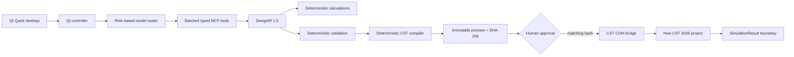

# Architecture

Prompt2CST is a Python 3.11/PySide6 desktop application with a local FastMCP
server. There is no browser frontend or HTTP backend. The backend boundary is
the local Python process and CST 2026 COM automation.

## Runtime pipeline

The target workflow is:

`RECEIVED -> REQUIREMENTS_PARSED -> CALCULATIONS_COMPLETED ->
GEOMETRY_PLANNED -> SIMULATION_PLANNED -> VALIDATED -> PREVIEW_READY ->
AWAITING_APPROVAL -> APPROVED -> EXECUTING -> COMPLETED`.

Failures enter `FAILED`. Workflow records, immutable plans, and execution
progress are stored below the configured state directory and survive UI
refreshes and non-destructive restarts.

## Trust boundaries

Model output is schema input, never executable code. Only the compiler creates
CST History List commands. Preview performs no COM writes. Execution needs the
stored plan ID, the exact SHA-256 content hash, and explicit approval. The
bridge creates a new project, records each completed operation, stops at the
exact failed operation, and saves only after the compiled sequence completes.

## Compatibility

Wire monopole, center-fed dipole, rectangular patch, and custom parametric
inputs have DesignIR adapters. Their original public tools remain available
while the batched DesignIR tools provide the universal path.

Live solver launch and live CST tree-result extraction remain disabled until
their CST 2026 automation syntax and licence controls are verified.
