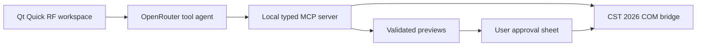

# Architecture

The model never receives a general code-execution tool. Preview and build are
separate operations. The desktop controller requests approval only for a typed
CST-writing tool, and the build continues only when the user accepts the exact
arguments and calculated preview.
